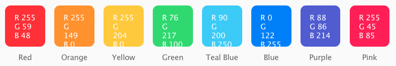
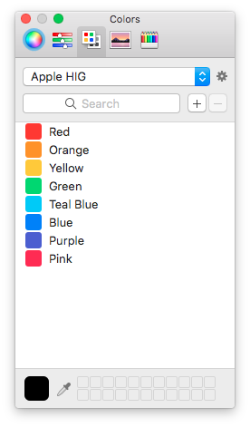

#Apple HUG colors
---
Color pallete in **.clr** format (Apple's Color Paletes) with colors from [Apple Human Interface Guidelines](https://developer.apple.com/ios/human-interface-guidelines/visual-design/color/) for iOS.
Use it with frameworks like [R.swift](https://github.com/mac-cain13/R.swift), [SwiftGen](https://github.com/SwiftGen/SwiftGen) or stand-alone.

Contains followings colors:

* **FF3B30**
* **FF9500**
* **FFCC00**
* **4CD964**
* **5AC8FA**
* **007AFF**
* **5856D6**
* **FF2D55**

### Installation & Usage
---
* **Standalone**:
	
	Just copy **Apple HUG.clr** to **~/Library/Colors/** folder, it will appear in Color Pallete utility:
	
	

* **Framework**:

	Refer to framework documentation.

###  License
---

All product names, trademarks and registered trademarks are property of their respective owners. All company, product and service names used in this website are for identification purposes only. Use of these names,trademarks and brands does not imply endorsement.

Apple, iOS, iPhone and iPad are trademarks of Apple Inc., registered in the U.S. and other countries.

All other trademarks cited herein are the property of their respective owners.

Released under MIT license, see [LICENSE.md](LICENSE.md) for more information.

###  Author
---
[m3g0byt3](https://github.com/m3g0byt3)